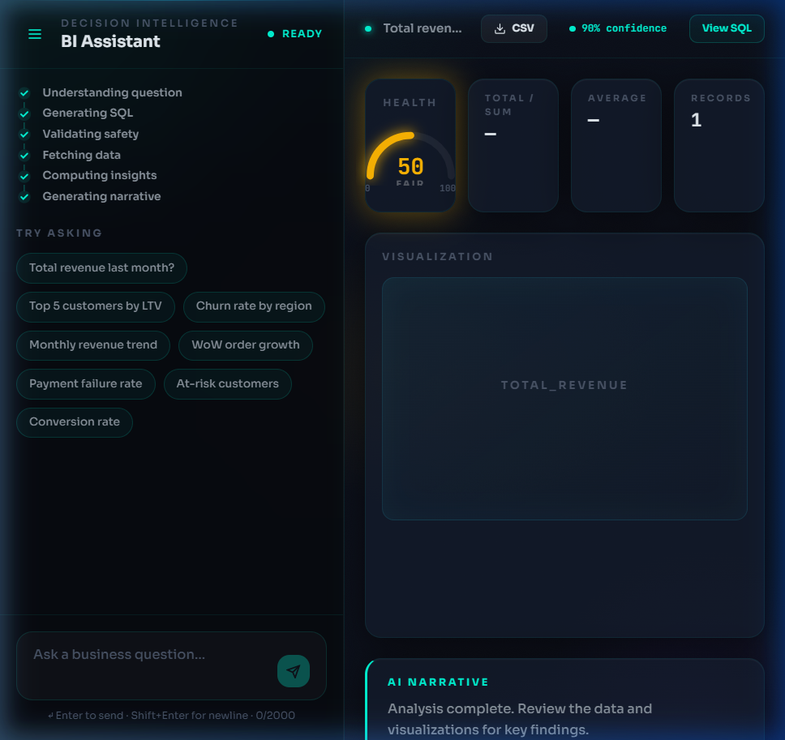

# Decision Intelligence BI Assistant
### FastAPI · Next.js · Supabase · Groq Llama-3

[](https://decision-bi-assistant.vercel.app)

> Ask business questions in plain English. Get SQL, charts, and statistical insights streamed live.



---

## Features

- **Agentic Self-Healing Loop**: Catches DB errors, sends the failed SQL back to the LLM, and auto-repairs (max 2 retries).
- **Semantic Metadata Layer**: `dictionary.json` encodes business logic to help the LLM write precise SQL based on business definitions.
- **PII Masking Layer**: Regex-based pre-processing strips emails, phones, and names before data reaches the LLM.
- **SSE Streaming Pipeline**: Real-time stream providing a SQL typing effect, live stepper, and non-blocking UX.
- **Statistical Insight Engine**: Auto-computes WoW growth, Z-score + IQR outlier detection, and a health score.
- **Safety**: Blocks DROP/DELETE/UPDATE/INSERT and injection patterns before execution.

---

## Architecture

```
┌─────────────────────────────────────────────────────────────┐
│  BROWSER — Next.js 14 + Tailwind + Framer Motion            │
│  ┌─────────────────┐       ┌──────────────────────────────┐ │
│  │   Chat Panel    │       │      Insight Canvas          │ │
│  │ • Glowing input │       │ • Recharts (auto-selected)   │ │
│  │ • 6-step stepper│  SSE  │ • Radial health gauge        │ │
│  │ • Suggestion    │◄──────│ • WoW / outlier cards        │ │
│  │   chips         │       │ • SQL typewriter terminal    │ │
│  │ • History drawer│       │ • AI narrative               │ │
│  └─────────────────┘       └──────────────────────────────┘ │
└──────────────────────────────┬──────────────────────────────┘
                               │ POST /api/query (SSE stream)
                               ▼
┌─────────────────────────────────────────────────────────────┐
│  FASTAPI — Railway                                          │
│                                                             │
│  ① NL Question → PII Mask                                  │
│  ② SQLAgent → Groq Llama-3 (schema + dictionary.json)      │
│  ③ Safety Validator (blocks DROP/injection)                 │
│  ④ asyncpg execute → self-heal on error (×2 retries)       │
│  ⑤ Insight Engine (WoW, outliers, health score)            │
│  ⑥ Narrative LLM call                                      │
│  ⑦ Stream all 6 steps as SSE events                        │
└────────────────────────┬────────────────────────────────────┘
                         │
           ┌─────────────┴──────────────┐
           │  Groq API (Llama-3 70B)    │  PostgreSQL — Supabase
           │  ~200-400ms per call       │  customers / orders / payments
           └────────────────────────────┘
```

---

## Project Structure

```
decision-intelligence-bi-assistant/
├── backend/
│   ├── app/
│   │   ├── main.py                  # FastAPI app + SSE pipeline
│   │   ├── dictionary.json          # ← Semantic metadata layer
│   │   ├── agent/
│   │   │   └── sql_agent.py         # SQLAgent + self-healing loop
│   │   ├── safety/
│   │   │   └── guard.py             # PII masking + SQL validation
│   │   ├── insights/
│   │   │   └── engine.py            # WoW, outliers, health score
│   │   └── db/
│   │       └── connection.py        # asyncpg pool (Supabase)
│   ├── generate_data.py             # Phase 1: dataset generator
│   ├── schema.sql                   # Run in Supabase first
│   ├── seed.sql                     # Run in Supabase second
│   ├── requirements.txt
│   ├── Dockerfile
│   └── .env.example
├── frontend/
│   ├── app/
│   │   ├── page.tsx                 # Split-panel dashboard
│   │   ├── layout.tsx               # IBM Plex Mono font
│   │   └── globals.css
│   ├── components/
│   │   ├── layout/
│   │   │   ├── ChatPanel.tsx        # Left: input + stepper
│   │   │   ├── InsightCanvas.tsx    # Right: chart + metrics
│   │   │   └── HistoryDrawer.tsx    # Session history
│   │   ├── ui/
│   │   │   ├── ThinkingStepper.tsx  # 6-step animated pipeline
│   │   │   ├── SQLTerminal.tsx      # Typewriter SQL effect
│   │   │   └── HealthGauge.tsx      # Radial SVG meter
│   │   └── charts/
│   │       └── ChartRenderer.tsx    # Recharts auto-switcher
│   ├── hooks/
│   │   └── useSSEStream.ts          # SSE state machine
│   ├── lib/types.ts
│   ├── package.json
│   ├── next.config.ts
│   ├── Dockerfile
│   └── .env.local.example
├── docker-compose.yml
└── README.md
```

---

## Setup — Step by Step

### Prerequisites
- Node.js 20+, Python 3.12+
- [Supabase](https://supabase.com) account (free)
- [Groq](https://console.groq.com) API key (free, no credit card)

---

### Step 1 — Clone

```bash
git clone https://github.com/Tilakkale/Decision-BI-Assistant.git
cd Decision-BI-Assistant
```

---

### Step 2 — Set up Supabase Database

1. Create a new project at [supabase.com](https://supabase.com)
2. Go to **SQL Editor** → New query
3. Paste and run `backend/schema.sql`
4. Generate the seed data:
   ```bash
   cd backend
   python generate_data.py
   ```
5. Paste and run `backend/seed.sql` in Supabase SQL Editor
6. Copy your connection string: **Settings → Database → Connection string → URI (Transaction mode)**

---

### Step 3 — Configure Backend

```bash
cd backend
cp .env.example .env
# Edit .env — paste your GROQ_API_KEY and DATABASE_URL
```

---

### Step 4 — Run Locally

**Option A — Docker Compose (recommended)**
```bash
# From project root
GROQ_API_KEY=gsk_... docker-compose up --build
```
- Backend:  http://localhost:8000
- Frontend: http://localhost:3000 (start separately below)

**Option B — Manual**
```bash
# Terminal 1: Backend
cd backend
python -m venv .venv && source .venv/bin/activate
pip install -r requirements.txt
uvicorn app.main:app --reload --port 8000

# Terminal 2: Frontend
cd frontend
npm install
cp .env.local.example .env.local
npm run dev
```

---

### Step 5 — Test the Self-Healing Loop

Ask: `"What is our conversion rate for enterprise customers last quarter?"`

This query joins multiple concepts from `dictionary.json` and exercises the LOWER() normalization. If Groq returns a slightly off column name, you'll see the **⚡ Self-healed** badge appear in the UI.

---

## Deployment

### Backend → Railway

1. Push to GitHub
2. [railway.app](https://railway.app) → New Project → Deploy from GitHub
3. **Root Directory:** `backend`
4. **Build:** Handled automatically via `railway.json` and Nixpacks
5. **Start:** Railway detects `Procfile` and `uvicorn`
6. Environment variables:
   - `DATABASE_URL` — your Supabase connection string
   - `GROQ_API_KEY` — your Groq key
   - `FRONTEND_URL` — your Vercel URL (after deploying frontend)

### Frontend → Vercel (free tier)

```bash
cd frontend
npx vercel --prod
# Set NEXT_PUBLIC_API_URL to your Railway backend URL
```

### Database → Supabase
- Already set up in Step 2
- Free tier: 500MB, sufficient for this project
- Use **Transaction mode (port 6543)** in DATABASE_URL for Railway compatibility


## Demo Walkthrough

| Step | Action | What You'll See |
|---|---|---|
| 1 | Open http://localhost:3000 | Dark executive dashboard |
| 2 | Click "Total revenue last month?" | 6-step pipeline animates |
| 3 | Watch step 2 complete | SQL appears with typewriter effect |
| 4 | Click `{ SQL }` button | Terminal drawer opens, syntax highlighted |
| 5 | Data loads | Bar chart auto-renders, health gauge fills |
| 6 | See insight cards | WoW%, outlier count, top performer |
| 7 | Read AI narrative | Executive summary with real numbers |
| 8 | Ask "Who are our at-risk customers?" | Tests `dictionary.json` definition |
| 9 | Ask a bad question | Triggers self-heal — see ⚡ badge |
| 10 | Click hamburger | History drawer shows all queries |


## Future Improvements

- [ ] **Supabase Auth** — JWT-based multi-tenant isolation
- [ ] **LangSmith tracing** — full LLM observability per query
- [ ] **Pinned dashboards** — save queries as persistent widgets
- [ ] **Schema upload** — connect any PostgreSQL database via URL
- [ ] **Slack bot** — `@dibi what was revenue last week?`
- [ ] **Fine-tuned model** — train on company-specific SQL patterns
- [ ] **Export** — PNG chart export for slide decks

---

## 📈 Lessons Learned & Best Practices

### 1. Python Package Structure (`__init__.py`)
*   **The Mistake**: Forgetting to add `__init__.py` files in backend subfolders.
*   **The Lesson**: Always add an empty `__init__.py` to every folder inside your `app` directory. This tells Python's import system that these are packages, which is critical for tools like `uvicorn` and certain cloud environments to find your modules.

### 2. Environment Variable Synchronization
*   **The Mistake**: Missing or mismatched URLs in Vercel and Railway.
*   **The Lesson**: 
    *   **Vercel (`NEXT_PUBLIC_API_URL`)**: Must point to the **Railway** Production URL.
    *   **Railway (`FRONTEND_URL`)**: Must point to the **Vercel** Production URL (for CORS security).
    *   **Tip**: Always include `https://` in these URLs.

### 3. Port Mapping & Start Commands
*   **The Mistake**: A mismatch between the "Target Port" in Railway settings and the port used in the `uvicorn` start command.
*   **The Lesson**: If you use the Railway `$PORT` variable in your start command, make sure the **Networking → Target Port** in Railway is **empty**. Alternatively, hardcode both to `8000`.

### 4. Professional Frontend UX
*   **Progress Indicators**: Always show the user that something is happening (steppers, typing effects).
*   **Error Handling**: Instead of "Failed to fetch", show a user-friendly error message with a "Retry" button.
*   **Data Visualization Strategy**: Choose the right chart (Line for trends, Bar for categories) and use interactive elements (tooltips).

---

*Stack: FastAPI · asyncpg · Groq Llama-3 · Next.js 14 · Recharts · Framer Motion · Supabase · Docker · Railway · Vercel*
